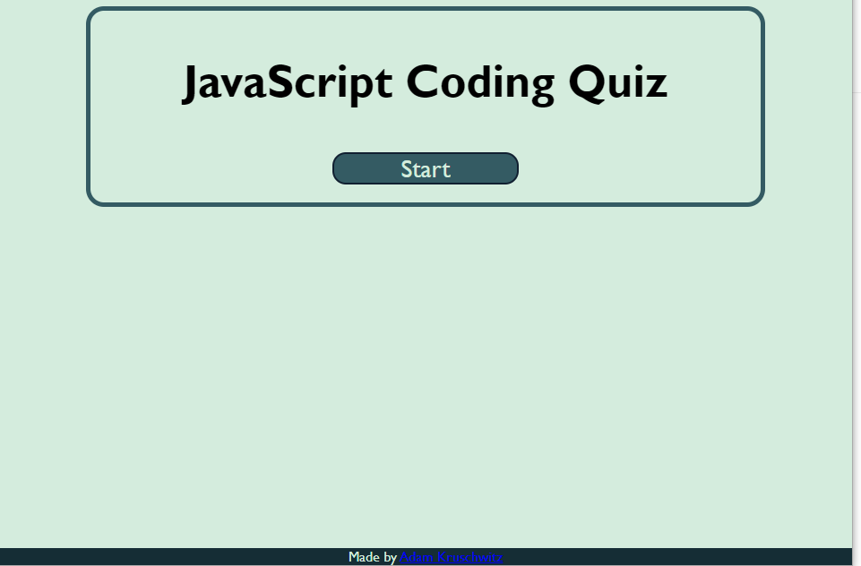

# Code Quiz

A web technologies quiz created as an interview prep tool. Made as an assignment for the UC Berkley Full Stack Web Development Coding Bootcamp. This website was created from scratch using HTML, CSS, and Javascript.

## Built With

* [HTML](https://developer.mozilla.org/en-US/docs/Web/HTML)
* [CSS](https://developer.mozilla.org/en-US/docs/Web/CSS)
* [Javascript](https://developer.mozilla.org/en-US/docs/Web/JavaScript)

## Deployed Link

* [See Live Site](https://adamkruschwitz.github.io/code-quiz/)

## Screenshot

## Authors

* # Adam Kruschwitz

- [Link to Portfolio Site](https://adamkruschwitz.github.io/Portfolio/)
- [Link to Github](https://github.com/AdamKruschwitz)
- [Link to LinkedIn](https://www.linkedin.com/in/AdamKruschwitz)

See also the list of [contributors](https://github.com/code-quiz/contributors) who participated in this project.

## License

This project is licensed under the MIT License 